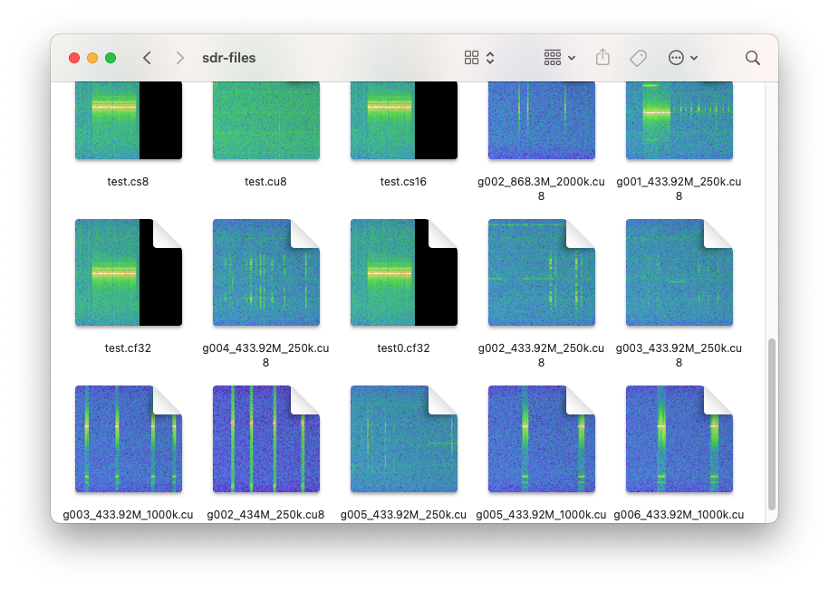

# SDR I/Q data Spectrogram QuickLook Plugin

This is an open-source QuickLook plugin to generate spectrogram thumbnails and previews for SDR I/Q data.
Requires Mac OS X 10.7 or later (but tested on 10.8).

Small preview in Finder windows:

Full QuickLook file preview:

## Supported file types

- `.cu4`
- `.cs4`
- `.cu8`, `.data`, `.complex16u`
- `.cs8`, `.complex16s`
- `.cu12`
- `.cs12`
- `.cu16`
- `.cs16`
- `.s16`
- `.cu32`
- `.cs32`
- `.s32`
- `.cf32`, `.cfile`, `.complex`
- `.f32`
- `.cu64`
- `.cs64`
- `.cf64`
- `.f64`
- `.sigmf`

## Installation

Go to [Releases](https://github.com/triq-org/iqspectrogram-quicklook/releases) and download the latest version.
Unzip the archive, and put `IQSpectrogram.qlgenerator` into `~/Library/QuickLook` (or `/Library/QuickLook` to install it for all users on your Mac).
You may need to create the QuickLook folder inside ~/Library first.

To get plugins working in MacOS Catalina and later, you will need to remove the quarantine attribute.

Run this to see the attributes:

    xattr -r ~/Library/QuickLook

And run this to remove the quarantine attribute:

    xattr -d -r com.apple.quarantine ~/Library/QuickLook

Then open a Terminal and run `qlmanage -r` to enable the plugin (or restart the Finder. Or logout and -in again. Or restart your Mac).

## Configuration

QuickLook Plugins are not allowed to access any configuration files. All settings are compiled in.
You might want to recompile if you want to change e.g. the preview size, gain and FFT settings, theme or color map.

## Development Notes

The plugin needs a precompiled `libtriq.a`.

Note that the UTI special dynamic type identifiers are `dyn.a<base32>` with the charset "abcdefghkmnpqrstuvwxyz0123456789".
Use e.g. https://github.com/darienhuss/custombase `./custombase.py -32 -c abcdefghkmnpqrstuvwxyz0123456789 -e -in '?0=6:1=cu8'`
